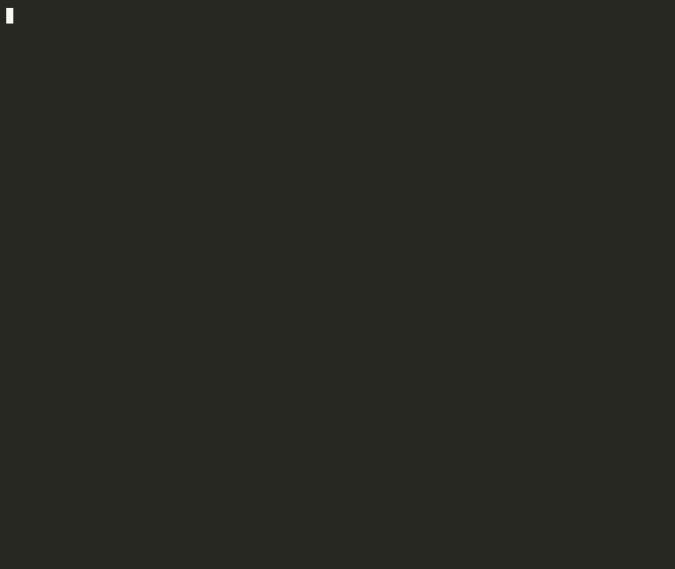

# codescope

[](https://crates.io/crates/codescope)
[](#license)
[](https://github.com/adventurewave-labs/codescope/actions)

> ⭐ If codescope saves you context tokens, [starring the repo](https://github.com/adventurewave-labs/codescope) helps others find it.

**A single-binary, blazing-fast code-intelligence engine for AI coding agents.**

## 🎬 Demo



*codescope indexing its own repo — 196 symbols, 1,322 edges in 188 ms — then a summary and a blast-radius query. Recorded from the actual binary with [asciinema](https://asciinema.org) + [agg](https://github.com/asciinema/agg).*

`codescope` indexes any repository into a precise, queryable structural graph and
serves it to AI agents over **MCP** (and CLI/JSON). Instead of letting an agent
grep blindly through files and burn its context window, it answers *"who calls
this, what breaks if I change it, where is this defined, what does this module
depend on"* in milliseconds — with **token-budgeted** output.

The precision of Sourcegraph, the install footprint of ripgrep, the interface of
an MCP server, and no cloud, no database, no Python.

## Capabilities

| Capability | CLI | MCP tool |
|---|---|---|
| Build/refresh the index (incremental) | `codescope index` | `cs_index` |
| Who calls a symbol (transitive) | `codescope callers X --depth N` | `cs_callers` |
| What a symbol calls (transitive) | `codescope callees X --depth N` | `cs_callees` |
| Blast radius of a change | `codescope blast-radius X` | `cs_blast_radius` |
| Where a symbol is defined | `codescope def X` | `cs_definition` |
| All references to a symbol | `codescope refs X` | `cs_references` |
| File/module import graph + cycles | `codescope deps` | `cs_dependency_graph` |
| Structural search | `codescope search "kind:function calls:db_query"` | `cs_structural_search` |
| Architectural overview | `codescope summary` | `cs_repo_summary` |

**Languages:** Rust, TypeScript, JavaScript, Python, Go (tree-sitter).

Every query is **token-budgeted** (`--max-tokens`, default 4000): results are
compact JSON with `symbol`, `kind`, `file`, `line_start/line_end`, edge lists,
and a `truncated` flag instead of dumping the whole graph.

## Install

```sh
cargo install --path .        # from this checkout
# or, once published:
# cargo install codescope
```

## Usage

```sh
codescope index                       # build/refresh the index for the cwd
codescope -p /path/to/repo index      # index a specific repo
codescope callers my_func --depth 2
codescope blast-radius src/auth.rs
codescope refs UserSession
codescope summary --max-tokens 4000
codescope search "kind:function calls:db.query returns:Result"
codescope callees do_thing --json     # machine-readable output
```

### Structural search

Space-separated terms; `key:value` are filters, bare words match name/signature:

- `kind:function|method|struct|enum|trait|interface|class|module|type|constant|field`
- `lang:rust|typescript|javascript|python|go`
- `file:<substr>` · `name:<substr>` · `calls:<callee>` · `returns:<type-substr>`

```sh
codescope search "kind:method lang:rust calls:spawn returns:Result"
```

## MCP server (for agents)

`codescope` speaks MCP over stdio (newline-delimited JSON-RPC). Start it with:

```sh
codescope serve --mcp
```

Register it with any MCP-capable agent (Claude Code, Cursor, Windsurf,
VS Code/Copilot, Cline, Zed, Continue). Example config:

```json
{
  "mcpServers": {
    "codescope": {
      "command": "codescope",
      "args": ["serve", "--mcp", "-p", "/abs/path/to/your/repo"]
    }
  }
}
```

Then the agent can call `cs_index` once and query `cs_callers`, `cs_blast_radius`,
`cs_structural_search`, etc. See [`docs/mcp.md`](docs/mcp.md) for the full tool
reference.

## Performance

Measured on a 4-core container (release build) — see [`docs/BENCHMARKS.md`](docs/BENCHMARKS.md):

- Cold index **100k LOC in ~0.2 s**; **~1M LOC in ~1.6 s**.
- Incremental re-index of one changed file in **~55 ms**.
- In-process query latency **< 2 ms** for every query type.
- On-disk index size is the one PRD target not met (~75% vs. <15%); the cause
  and remediation are documented honestly in the benchmarks doc and ADR-0005.

## How it works

```
repo → Walker (ignore-aware) → tree-sitter parsers → Symbol/edge extraction
     → CodeGraph (in-memory, indexed) → redb (embedded, on-disk)
     → Query API → CLI / JSON / MCP
```

- **Parsing:** tree-sitter (robust error recovery, incremental).
- **Resolution:** two-tier — fast tree-sitter name/scope heuristics now (labeled
  `heuristic`), with a SCIP precision tier designed in (labeled `precise`).
- **Storage:** embedded, single-file, memory-mapped redb. No external DB.
- **Concurrency:** rayon for parallel parsing/extraction.

## Documentation

- **Architecture Decision Records:** [`docs/adr/`](docs/adr/) (14 ADRs).
- **Domain-Driven Design:** [`docs/ddd/`](docs/ddd/) — ubiquitous language,
  bounded contexts, domain model, services & repositories.
- **Benchmarks & validation:** [`docs/BENCHMARKS.md`](docs/BENCHMARKS.md).
- **Product requirements:** [`plans/codescope.prd`](plans/codescope.prd).

## Ecosystem

| Repo | What it does |
|------|-------------|
| [**secret-scan**](https://github.com/adventurewave-labs/secret-scan) | Rust secret scanner — pattern + entropy-based detection, Base64/hex obfuscation detection |
| [**Sentinel**](https://github.com/marcuspat/Sentinel) | Deny-by-default agentic sysadmin: Investigate → Plan → Approve → Act |
| [**turbo-flow**](https://github.com/marcuspat/turbo-flow) | Agentic dev environment — Ruflo v3.5 orchestration, 60+ agents, git-worktree isolation |

## License

Dual-licensed under either [MIT](LICENSE-MIT) or [Apache-2.0](LICENSE-APACHE) at
your option.
